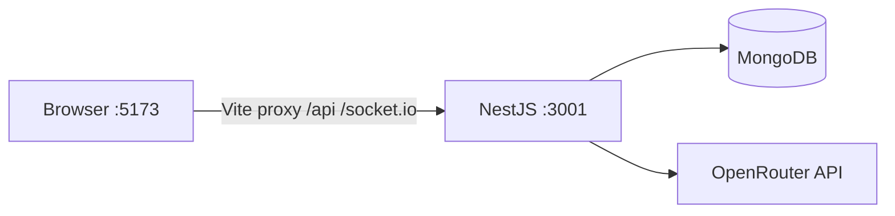

# Resume Builder Documentation

AI-powered resume tailor: NestJS backend + React (Vite) frontend, MongoDB storage, OpenRouter for model inference.

## System overview

| Layer | Package | Role |
|-------|---------|------|
| Backend | `apps/backend` (`resume-builder-backend`) | REST API under `/api`, Socket.IO progress events, PDFKit PDFs, OpenRouter calls |
| Frontend | `apps/frontend` (`resume-builder-frontend`) | Auth UI, resume list/generate, profile settings, admin users |
| Shared | `packages/shared` (`@resume-builder/shared`) | Templates, AI defaults, resume settings, messages, filename sanitize |



## How the apps connect

1. Frontend axios client uses `VITE_API_BASE_URL` when set; otherwise same-origin `/api` (Vite proxy → Nest).
2. Socket.IO client uses `VITE_SOCKET_URL` when set; otherwise `window.location.origin` so `/socket.io` is also proxied.
3. JWT Bearer token from login/register is stored in `localStorage` as `access_token` and sent on API requests.
4. Resume generation: `POST /api/resumes/generate` returns an SSE `started` event with `resumeId`, then work continues in the background; completion/failure is pushed via Socket.IO (`generate:done` / `generate:failed`).

## Local development

**Ports**

| Service | Port |
|---------|------|
| Backend (Nest) | **3001** |
| Frontend (Vite) | **5173** |

**Prerequisites:** Node.js 18+, MongoDB, OpenRouter API key (per-user in Profile).

```bash
# From repo root
npm install

# apps/backend/.env
DATABASE_URL=mongodb://localhost:27017/ResumeBuilder
ENCRYPTION_KEY=your_encryption_secret
PORT=3001

npm run dev
```

- Backend: http://localhost:3001/api  
- Frontend: http://localhost:5173  

Optional frontend env (`apps/frontend/.env`):

```env
# Leave empty in local dev to use Vite proxy
VITE_API_BASE_URL=
VITE_SOCKET_URL=
VITE_BACKEND_PORT=3001
# Optional override if proxy cannot reach Nest on loopback
# VITE_PROXY_TARGET=http://192.168.x.x:3001
```

Vite proxies `/api` and `/socket.io` to Nest on port `VITE_BACKEND_PORT` (default `3001`), preferring a non-loopback LAN IP when available (see `apps/frontend/vite.config.ts`).

## Doc index

| Doc | Topic |
|-----|--------|
| [auth/workflow.md](./auth/workflow.md) | Register, login, JWT, guards |
| [users/workflow.md](./users/workflow.md) | Profile, admin CRUD, encrypted keys, resume settings |
| [resumes/workflow.md](./resumes/workflow.md) | Generate, from-json, retry, filters, Q&A |
| [ai/workflow.md](./ai/workflow.md) | OpenRouter, model catalog, prompts, JSON parsing |
| [pdf-templates/workflow.md](./pdf-templates/workflow.md) | Templates, PDFKit, cover letters |
| [frontend/workflow.md](./frontend/workflow.md) | Routes, ProtectedLayout, theme, proxy |
| [api/reference.md](./api/reference.md) | REST routes + WebSocket events |
| [architecture/overview.md](./architecture/overview.md) | Module map, data flow, refactor boundaries |
| [testing/smoke-checklist.md](./testing/smoke-checklist.md) | Manual smoke tests |
