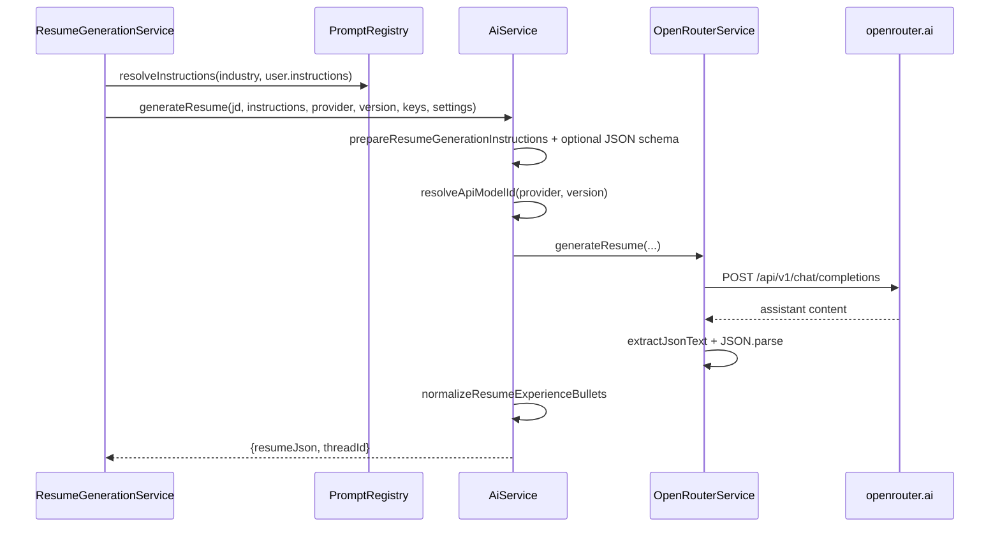

# AI workflow

## Purpose

Call OpenRouter for resume JSON generation, cover letters, and application Q&A; expose a cached model catalog; resolve industry/user prompts; parse and normalize model JSON output.

## Actors

| Actor | Role |
|-------|------|
| AiService | High-level orchestration (instructions, schema, normalize) |
| OpenRouterService | HTTP chat completions + JSON extraction |
| OpenRouterModelsService | `GET` OpenRouter `/models`, 1-hour cache |
| PromptRegistryService | Load industry `.md` prompts from disk |
| UsersService | Supply decrypted API keys + resume settings |
| AiController | `GET /api/ai/models` |

## Sequence diagrams

### Resume generation via OpenRouter



### Model catalog

```mermaid
sequenceDiagram
  participant UI as Frontend AiModelsProvider
  participant Ctrl as AiController
  participant Models as OpenRouterModelsService
  participant API as openrouter.ai

  UI->>Ctrl: GET /api/ai/models (JWT)
  Ctrl->>Models: getCatalog()
  alt cache &lt; 1h
    Models-->>Ctrl: cached catalog
  else refresh
    Models->>API: GET /api/v1/models
    Models->>Models: group by provider, pickDefaults
    Models-->>Ctrl: catalog
  end
  Ctrl-->>UI: {providers, defaults}
```

## Key files

| Path | Notes |
|------|--------|
| `apps/backend/src/ai/ai.service.ts` | Resume / cover letter / Q&A entrypoints |
| `apps/backend/src/ai/ai.controller.ts` | Models endpoint |
| `apps/backend/src/ai/ai.module.ts` | Module wiring |
| `apps/backend/src/ai/openrouter-models.service.ts` | Catalog + defaults |
| `apps/backend/src/ai/ai-models.ts` | Legacy id normalization |
| `apps/backend/src/ai/default-prompts.ts` | Default Q&A / cover letter prompts |
| `apps/backend/src/ai/resume-json-schema.ts` | Structured output schema builder |
| `apps/backend/src/ai/prepare-resume-instructions.ts` | Merge prompt + schema rules |
| `apps/backend/src/ai/extract-json-text.ts` | Fence / brace extraction |
| `apps/backend/src/ai/parse-questions-response.ts` | Q&A JSON shape parsing |
| `apps/backend/src/ai/normalize-resume-json.ts` | Experience bullet cleanup |
| `apps/backend/src/ai/format-ai-error.ts` | User-facing error strings |
| `apps/backend/src/openrouter/openrouter.service.ts` | Provider HTTP client |
| `apps/backend/src/resumes/prompt-registry.service.ts` | Industry prompt files |
| `apps/backend/assets/prompts/industries/*.md` | Industry instruction packs |
| `packages/shared/src/ai-models.ts` | Shared defaults / helpers |

**Supported industries (PromptRegistry):** `ai`, `cybersecurity`, `ecommerce`, `fintech`, `food`, `insurance`, `marketing`, `realestate`, `gaming`, `telecom`, `healthcare`. Use `default` (or omit for retry) to use the user’s Profile `instructions`.

## Env vars

| Variable | Purpose |
|----------|---------|
| `ENCRYPTION_KEY` | Decrypt per-user OpenRouter key |
| _(none)_ | OpenRouter base URL is hard-coded to `https://openrouter.ai/api/v1` |

API keys are **per user**, not a global server env key.

## API endpoints

| Method | Path | Auth | Description |
|--------|------|------|-------------|
| `GET` | `/api/ai/models` | JWT | Cached provider/model catalog + defaults |

Catalog `defaults` include: `aiModel`, `aiVersion`, `fromJsonAiModel`, `fromJsonAiVersion` (e.g. anthropic / `anthropic/claude-sonnet-4.6`, openai / `openai/gpt-5.2`).

AI generation itself is invoked through resume routes (`/api/resumes/generate`, cover letter, answer-questions), not separate `/api/ai/*` write endpoints.

## Error cases

| Case | Behavior |
|------|----------|
| Missing OpenRouter key | Thrown before/during call; surfaced as 400 or failed resume |
| Empty user instructions when industry=`default` | `404` No resume prompt configured |
| Unknown industry id | `404` Unknown industry prompt |
| Missing industry `.md` file | `404` Industry prompt file not found |
| OpenRouter HTTP error | Error with status + provider metadata |
| Non-JSON / unparseable model output | Parse error; may retry once for structured-output failures |
| Models list fetch fails | Error: Failed to fetch models from OpenRouter |

## MongoDB data

AI does not own a dedicated collection. It reads/writes through:

| Collection | Fields used |
|------------|-------------|
| `users` | `encryptedOpenrouterApiKey`, `instructions`, prompts, `resumeSettings`, AI defaults |
| `resumes` | `jobDescription`, `aiModel`, `aiVersion`, `resumeJson`, `conversationId`, `coverLetter`, `answers`, `status`, `failureMessage` |
