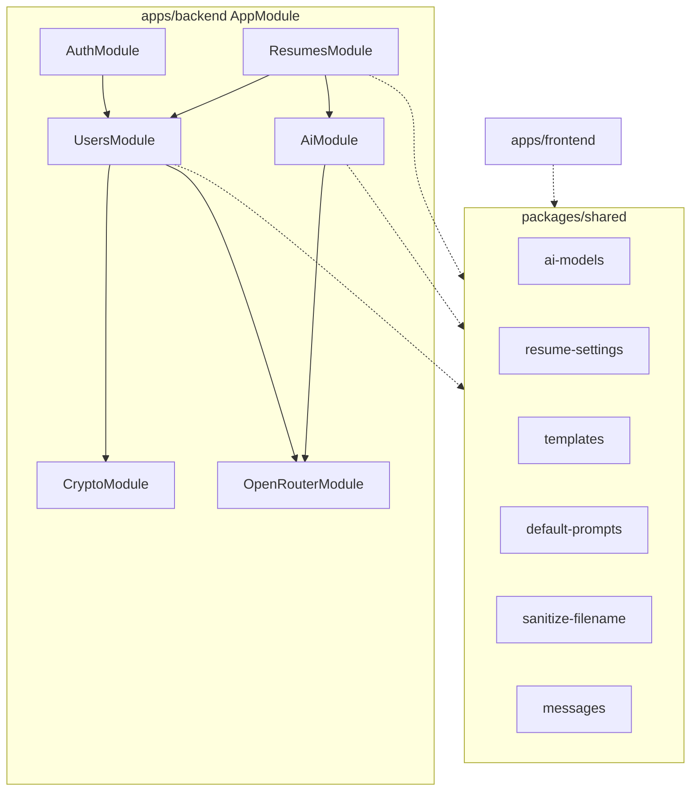
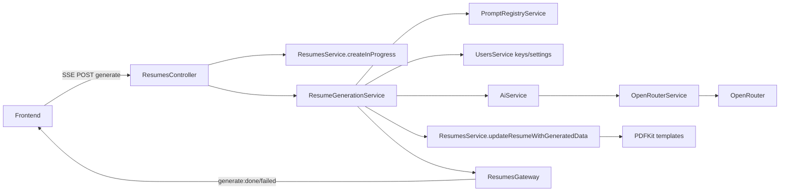

# Architecture overview

## Purpose

Map Nest modules, request/data flow, and intentional service boundaries after splitting generation, prompts, cover-letter PDF, and shared constants into dedicated units (`PromptRegistry`, `ResumeGeneration`, `CoverLetterPdf`, `@resume-builder/shared`).

## Module map

| Module | Responsibilities |
|--------|------------------|
| **AuthModule** | Register/login, JWT + Local strategies, AdminGuard export |
| **UsersModule** | Profile/admin CRUD, encrypt OpenRouter keys, resume settings |
| **ResumesModule** | HTTP controller, gateway, PDF templates, orchestration services |
| **AiModule** | AiService, models catalog controller, OpenRouterModelsService |
| **OpenRouterModule** | Low-level OpenRouter HTTP |
| **CryptoModule** | AES-256-GCM EncryptionService |
| **@resume-builder/shared** | Cross-app constants and pure helpers |

## Data flow (resume generate)

1. Controller validates API key, inserts `in_progress` resume, ends SSE with `resumeId`.
2. `ResumeGenerationService` resolves prompts, calls AI, updates Mongo + emits socket.
3. Downloads rebuild PDF from `resumeJson` + user template (no PDF blob in DB).

## Refactor boundaries

Keep these seams clear when extending the system:

### PromptRegistryService

- **Owns:** Loading/caching `assets/prompts/industries/*.md`, validating industry ids, falling back to user `instructions` for `default`.
- **Does not own:** OpenRouter calls, resume persistence, PDF rendering.
- **File:** `apps/backend/src/resumes/prompt-registry.service.ts`

### ResumeGenerationService

- **Owns:** End-to-end async AI generation for an existing resume id (prompt resolve → AI → update record → socket).
- **Does not own:** HTTP/SSE framing, list filters, from-json, cover letter HTTP, template preview.
- **File:** `apps/backend/src/resumes/resume-generation.service.ts`
- **Collaborators:** `PromptRegistryService`, `AiService`, `UsersService`, `ResumesService`, `ResumesGateway`

### CoverLetterPdfService

- **Owns:** Cover letter text normalization (JSON unwrap, dates, newlines) and PDFKit cover letter layout.
- **Does not own:** Calling OpenRouter or deciding when to regenerate; that stays in `ResumesService.generateCoverLetterForResume`.
- **File:** `apps/backend/src/resumes/cover-letter-pdf.service.ts`

### ResumesService

- **Owns:** Mongo CRUD, filters, PDF template selection, downloads, retry gating, Q&A persistence, cover-letter orchestration.
- Prefer not to re-inline industry file I/O or cover-letter PDF drawing here.

### @resume-builder/shared

- **Owns:** Shared pure data: template ids/labels, default AI model constants, resume settings resolve/defaults, default prompt strings, filename sanitize, shared error message constants.
- **Consumed by:** Nest services/controllers and Vite frontend (alias to `packages/shared/src` in dev; built `dist` in production builds).
- **Does not own:** Nest DI, Mongo schemas, or React components.

### AiService vs OpenRouterService

- **AiService:** Product-level prompts, schema flags, model id resolution, normalization.
- **OpenRouterService:** HTTP, auth header from user key, raw JSON extraction/retries.

## MongoDB collections

| Collection | Primary schema |
|------------|----------------|
| `users` | `apps/backend/src/users/schemas/user.schema.ts` |
| `resumes` | `apps/backend/src/resumes/schemas/resume.schema.ts` |

## Frontend package alignment

| Concern | Location |
|---------|----------|
| Routing / auth gates | `ProtectedLayout`, `main.tsx` |
| API + sockets | `apiClient`, `resumeService`, `socket.tsx` |
| Theme | `ThemeContext` + `theme/` |
| Shared constants | `@resume-builder/shared` |

## Related docs

- [API reference](../api/reference.md)
- [Resumes workflow](../resumes/workflow.md)
- [AI workflow](../ai/workflow.md)
- [Docs home](../README.md)
