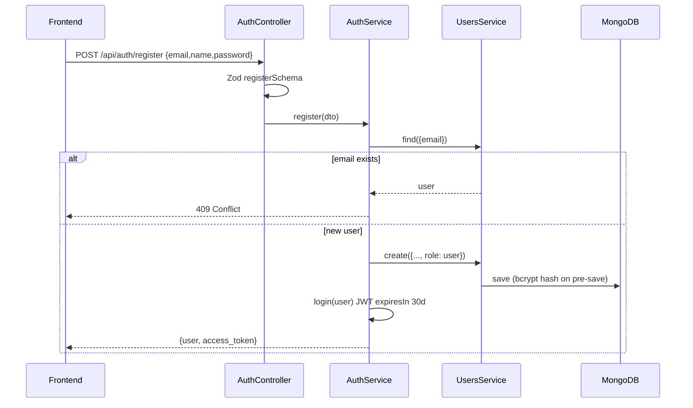
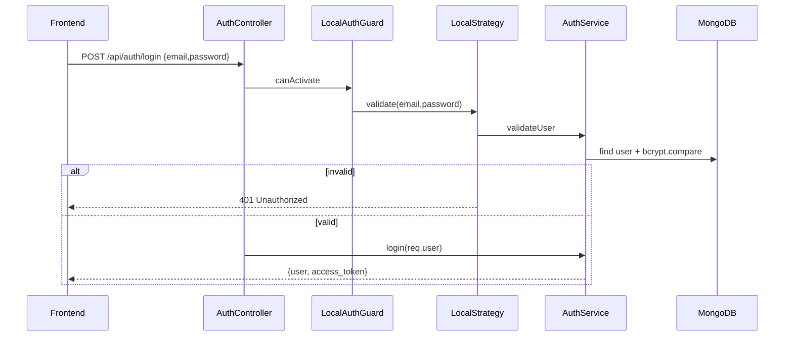
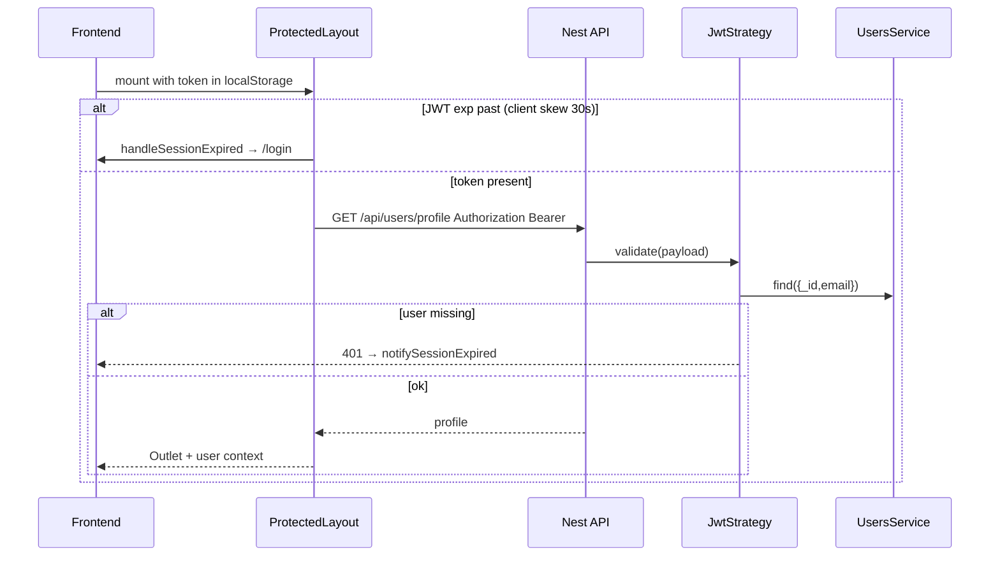

# Auth workflow

## Purpose

Register new users, authenticate with email/password, issue JWTs, and protect API routes with Passport strategies and role guards.

## Actors

| Actor | Role |
|-------|------|
| Anonymous user | Registers or logs in |
| Authenticated user | Holds Bearer JWT; accesses user-scoped APIs |
| Admin | Same JWT + `role: admin`; passes `AdminGuard` |
| Nest AuthModule | Validates credentials, signs JWT, loads user on each request |
| Frontend AuthContext | Stores `access_token`, clears on expiry/401 |

## Sequence diagrams

### Register

### Login

### Authenticated request + session expiry

## Key files

| Path | Notes |
|------|--------|
| `apps/backend/src/auth/auth.controller.ts` | `POST register`, `POST login` |
| `apps/backend/src/auth/auth.service.ts` | bcrypt validate, JWT sign, register |
| `apps/backend/src/auth/auth.module.ts` | JwtModule `expiresIn: '30d'` |
| `apps/backend/src/auth/jwt.strategy.ts` | Bearer extract; reload user |
| `apps/backend/src/auth/local.strategy.ts` | `usernameField: 'email'` |
| `apps/backend/src/auth/jwt-auth.guard.ts` | Passport JWT guard |
| `apps/backend/src/auth/local-auth.guard.ts` | Passport local guard |
| `apps/backend/src/auth/admin.guard.ts` | Requires `user.role === 'admin'` |
| `apps/backend/src/auth/constants.ts` | JWT secret |
| `apps/backend/src/auth/dto/register.dto.ts` | Zod: email, name, password ≥ 6 |
| `apps/frontend/src/components/common/AuthContext.tsx` | Token state |
| `apps/frontend/src/utils/authSession.ts` | Headers, `isTokenExpired` |
| `apps/frontend/src/services/apiClient.ts` | 401 → session expired |

## Env vars

| Variable | Where | Purpose |
|----------|--------|---------|
| _(none for JWT)_ | Backend | Secret is currently in `jwtConstants.secret` (code constant) |
| `FRONTEND_URL` | Backend CORS | Optional comma-separated origins; default allows all (`true`) |

JWT lifetime is hard-coded to **30 days** in `AuthService.login` and `JwtModule.register`.

## API endpoints

| Method | Path | Auth | Description |
|--------|------|------|-------------|
| `POST` | `/api/auth/register` | Public | Create user (`role: user`), return JWT |
| `POST` | `/api/auth/login` | Public (LocalAuthGuard) | Validate password, return JWT |

**Register body:** `{ email, name, password }`  
**Login body:** `{ email, password }`  
**Success:** `{ user: {_id,name,email,role,template}, access_token }`

Protected routes use `Authorization: Bearer <access_token>` via `JwtAuthGuard`. Admin routes also use `AdminGuard`.

## Error cases

| Case | Status / behavior |
|------|-------------------|
| Duplicate email on register | `409 Conflict` — "Email is already registered" |
| Invalid register payload | Validation error (Zod) |
| Bad login credentials | `401 Unauthorized` |
| Missing/invalid JWT | `401 Unauthorized` |
| JWT user no longer in DB | `401 Unauthorized` |
| Non-admin hits admin route | `403 Forbidden` — "Admin access required" |
| Client JWT past `exp` | Cleared locally; redirect login (30s skew) |
| API `401` on any call | `notifySessionExpired` / logout |

## MongoDB data

**Collection:** `users` (Mongoose `User`)

Auth-relevant fields:

| Field | Type | Notes |
|-------|------|--------|
| `email` | string | Unique |
| `name` | string | |
| `password` | string | bcrypt-hashed on save |
| `role` | `'user' \| 'admin'` | Default `user` |

JWT payload stores `{ _id, email }` only; each request re-hydrates name, role, and template from MongoDB.
