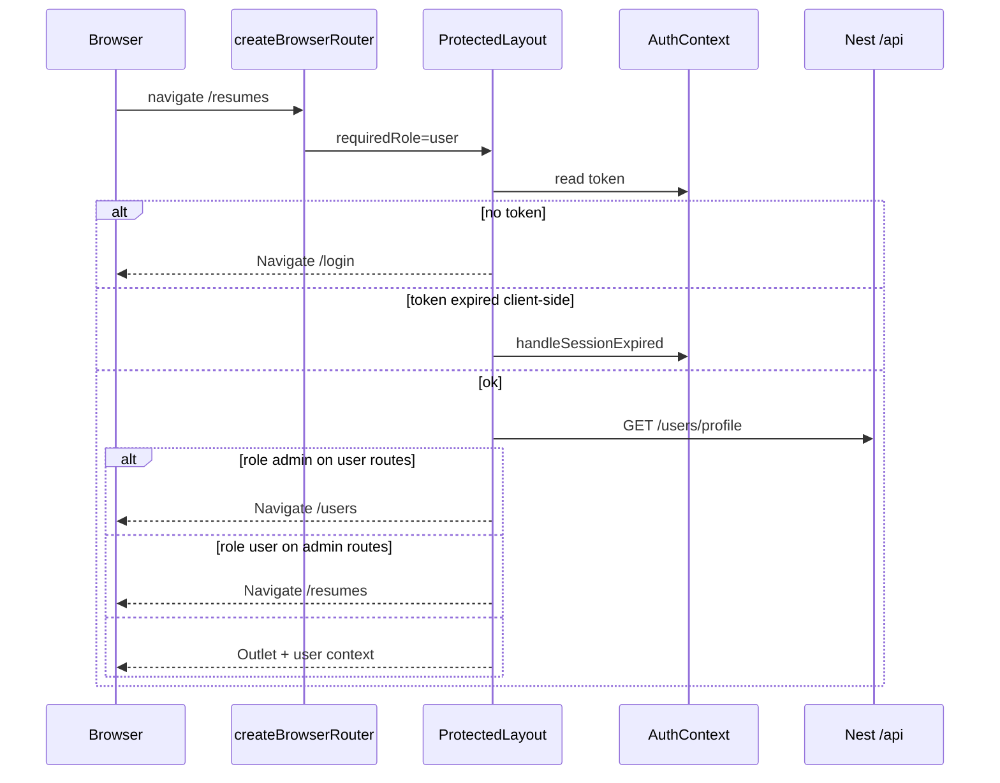
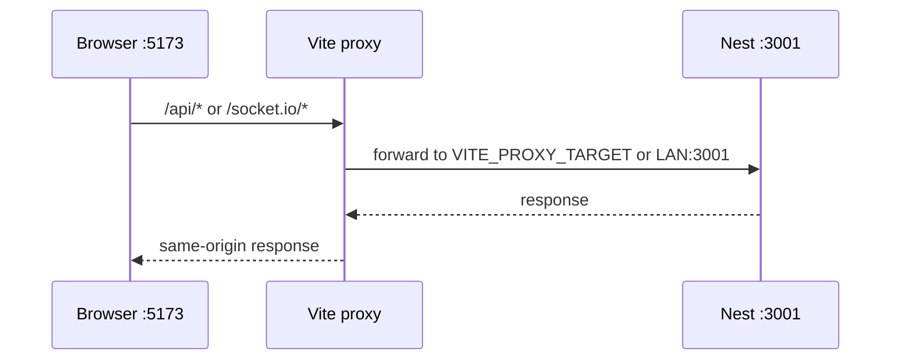

# Frontend workflow

## Purpose

React + Vite SPA for login/register, role-based routing, resume management, profile/settings, theme mode, and proxied API/socket access to the Nest backend.

## Actors

| Actor | Role |
|-------|------|
| End user / admin | Browser client |
| AuthProvider | JWT in `localStorage` |
| ProtectedLayout | Gate routes; load profile; role redirect |
| NonPrivateLayout | Login/register when unauthenticated |
| AiModelsProvider | Catalog from `GET /api/ai/models` |
| ThemeModeProvider | light/dark MUI theme |
| Vite dev server | Proxy `/api` + `/socket.io` → Nest :3001 |

## Sequence diagrams

### Boot + protected navigation

### Vite proxy (local dev)

## Key files

| Path | Notes |
|------|--------|
| `apps/frontend/src/main.tsx` | Router tree + providers |
| `apps/frontend/src/components/common/ProtectedLayout.tsx` | Auth + role gates |
| `apps/frontend/src/components/common/NonPrivateLayout.tsx` | Public auth pages |
| `apps/frontend/src/components/common/AuthContext.tsx` | Token login/logout |
| `apps/frontend/src/components/common/ThemeContext.tsx` | `theme-mode` localStorage |
| `apps/frontend/src/components/common/AiModelsContext.tsx` | Model catalog |
| `apps/frontend/src/services/apiClient.ts` | Axios + Bearer + 401 handler |
| `apps/frontend/src/pages/resumes/socket.tsx` | Socket.IO client |
| `apps/frontend/vite.config.ts` | Proxy + `@resume-builder/shared` alias |
| `apps/frontend/src/theme/` | MUI theme factory |

## Routes

| Path | Layout | Role | Page |
|------|--------|------|------|
| `/users` | Protected | admin | Users admin |
| `/` (admin) | Protected | admin | Redirect → `/users` |
| `/resumes` | Protected | user | Resume list |
| `/resumes/new` | Protected | user | Create / generate |
| `/fromjson` | Protected | user | Redirect → `/resumes/new?fromJson=1` |
| `/settings` | Protected | user | Profile |
| `/login`, `/register` | NonPrivate | public | Auth forms |
| `*` | — | — | Redirect → `/resumes` |

Admins hitting user routes are sent to `/users`; non-admins hitting admin routes go to `/resumes`.

## Env vars

| Variable | Purpose |
|----------|---------|
| `VITE_API_BASE_URL` | Absolute API origin; leave empty to use same-origin + proxy |
| `VITE_SOCKET_URL` | Socket origin; default `window.location.origin` |
| `VITE_BACKEND_PORT` | Proxy target port (default `3001`) |
| `VITE_PROXY_TARGET` / `NEST_PROXY_TARGET` | Full proxy URL override |

## API endpoints (consumed)

Frontend calls the REST surface documented in [api/reference.md](../api/reference.md), notably auth, users/profile, resumes/*, and `GET /api/ai/models`. Socket events: `generate:done`, `generate:failed`.

## Error cases

| Case | UI behavior |
|------|-------------|
| No / expired token | Redirect login; clear storage |
| Profile `401` | Session expired handler |
| Profile load failure (non-401) | Error alert + Retry |
| Wrong role for route | Redirect to role home |
| Generate SSE `type:error` | Toast / error message |
| Socket failure events | List refresh / failure state |

## MongoDB data

Frontend does not access MongoDB directly. It consumes user and resume JSON shapes returned by the API (see users/resumes workflow docs).
