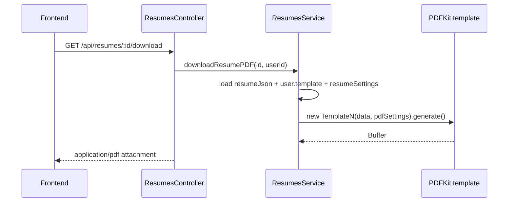
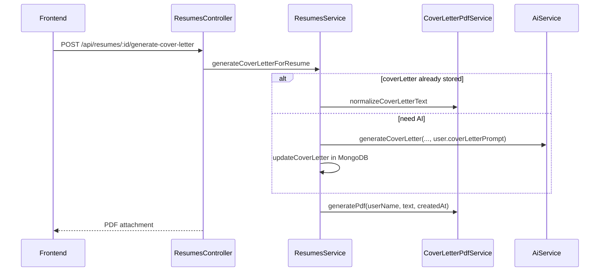
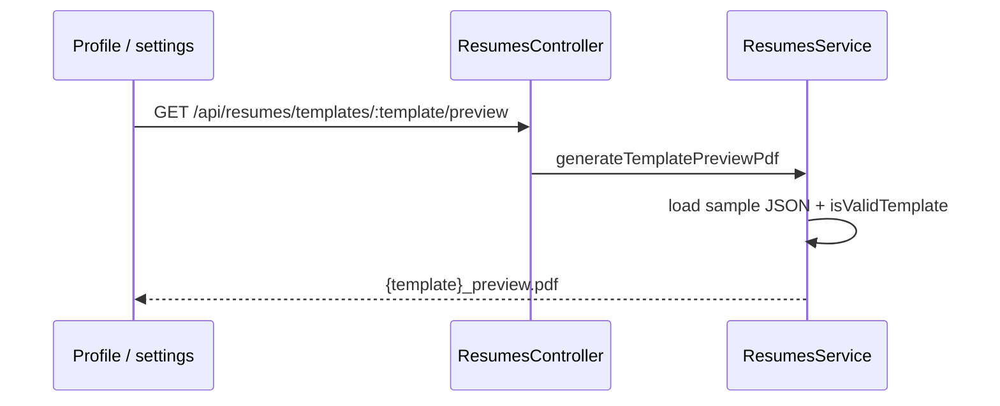

# PDF templates & cover letter workflow

## Purpose

Render resume PDFs with PDFKit across seven templates, apply per-user resume display settings, preview templates with sample data, and generate cover-letter PDFs from stored or freshly AI-generated text.

## Actors

| Actor | Role |
|-------|------|
| Authenticated user | Chooses `template` on profile; downloads PDFs |
| ResumesService | Selects template class, applies PDF settings, streams buffers |
| Template classes | `ResumePDFTemplate1`…`7` (PDFKit) |
| CoverLetterPdfService | Normalize text + PDFKit cover letter layout |
| AiService | Optional cover letter text generation |

## Sequence diagrams

### Resume PDF download / generation

### Cover letter

### Template preview

## Key files

| Path | Notes |
|------|--------|
| `apps/backend/src/resumes/templates/index.ts` | Exports + `ResumeData` type |
| `apps/backend/src/resumes/templates/template_1.ts` … `template_7.ts` | Layouts |
| `apps/backend/src/resumes/templates/base-pdf-template.ts` | Shared normalize helpers |
| `apps/backend/src/resumes/templates/certification-utils.ts` | Certification text |
| `apps/backend/src/resumes/cover-letter-pdf.service.ts` | Cover letter PDF |
| `apps/backend/src/resumes/resumes.service.ts` | `generatePDF`, downloads, preview |
| `packages/shared/src/templates.ts` | `VALID_TEMPLATES`, labels |
| `apps/backend/src/ai/resume-settings.ts` | PDF-related settings mapping |

Template ids: `template1` … `template7` (user `template` field + `@resume-builder/shared`).

## Env vars

No PDF-specific env vars. Generation uses Nest process working directory for sample preview JSON if configured in service paths.

| Variable | Indirect use |
|----------|----------------|
| `ENCRYPTION_KEY` | Required if cover letter needs a new AI call |

## API endpoints

| Method | Path | Description |
|--------|------|-------------|
| `GET` | `/api/resumes/templates/:template/preview` | Sample resume PDF for template id |
| `GET` | `/api/resumes/:id/download` | Resume PDF |
| `POST` | `/api/resumes/:id/generate-cover-letter` | Create/reuse cover letter PDF |
| `GET` | `/api/resumes/:id/download-cover-letter` | Download existing cover letter PDF |
| `POST` | `/api/resumes/from-json` | Also returns a PDF immediately |

Profile template selection is via `PUT /api/users/profile` (`template` field), not a dedicated PDF route.

## Error cases

| Case | Response |
|------|----------|
| Invalid template id on preview | `400` Invalid template |
| Sample JSON missing/unparseable | `404` / `400` |
| Resume / cover letter not found | `404` |
| Cover letter generate without job description (and no stored letter) | `400` |
| Missing OpenRouter key when AI cover letter needed | `400` |
| User name missing | `404` |

## MongoDB data

| Collection | Fields |
|------------|--------|
| `users.template` | Active PDF layout id |
| `users.resumeSettings` | showTitle, showSubTitle, showCompanySkills, skillCategories → PDF filtering |
| `resumes.resumeJson` | Source for resume PDF |
| `resumes.coverLetter` | Source for cover letter PDF |

PDF binary files are not persisted in the database.
