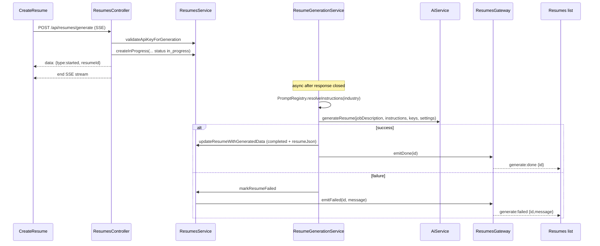
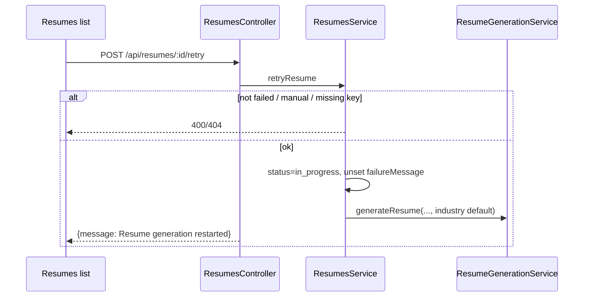
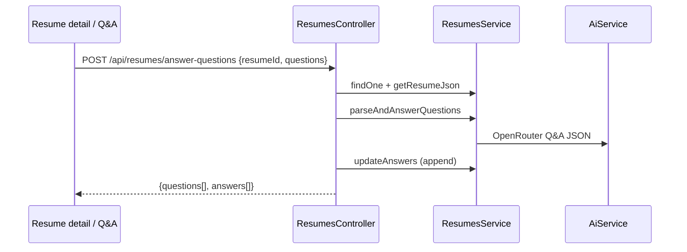

# Resumes workflow

## Purpose

Create and manage tailored resumes: async AI generation (SSE kickoff + Socket.IO completion), manual from-JSON PDF creation, retry of failed AI jobs, list filters, application Q&A, downloads, and cover letters. There is **no** generic `POST /api/resumes` create endpoint.

## Actors

| Actor | Role |
|-------|------|
| Authenticated user | Owns resumes scoped by `userId` |
| ResumesController | HTTP + SSE |
| ResumeGenerationService | Background AI → JSON → PDF update |
| ResumesService | CRUD, filters, download, cover letter orchestration |
| ResumesGateway | Emits `generate:done` / `generate:failed` |
| PromptRegistryService | Industry vs user instructions |
| AiService / OpenRouter | Model inference |
| Frontend resume list | Listens to sockets; generate page uses SSE |

## Sequence diagrams

### Generate (SSE + background + socket)



### From JSON

```mermaid
sequenceDiagram
  participant UI as CreateResume fromJson
  participant API as ResumesController
  participant Svc as ResumesService

  UI->>API: POST /api/resumes/from-json
  API->>API: strip cover_letter; fix mailto email
  API->>Svc: create(..., status completed, generationSource manual)
  Svc-->>UI: PDF attachment (application/pdf)
```

### Retry failed AI resume



### Answer application questions



## Key files

| Path | Notes |
|------|--------|
| `apps/backend/src/resumes/resumes.controller.ts` | All resume HTTP routes |
| `apps/backend/src/resumes/resumes.service.ts` | Persistence, PDF, retry, Q&A |
| `apps/backend/src/resumes/resume-generation.service.ts` | Async generation pipeline |
| `apps/backend/src/resumes/resumes.gateway.ts` | Socket.IO emits |
| `apps/backend/src/resumes/prompt-registry.service.ts` | Industry markdown prompts |
| `apps/backend/src/resumes/schemas/resume.schema.ts` | Resume document |
| `apps/backend/src/resumes/dto/*.ts` | Zod DTOs |
| `apps/frontend/src/pages/resumes/` | List + CreateResume |
| `apps/frontend/src/pages/resumes/socket.tsx` | Socket.IO client |
| `apps/frontend/src/services/resumeService.ts` | API helpers |

## Env vars

| Variable | Purpose |
|----------|---------|
| `DATABASE_URL` | Resume documents |
| `ENCRYPTION_KEY` | Decrypt user OpenRouter key for generation |
| `PORT` | Backend listen (default **3001** in `main.ts`) |
| `FRONTEND_URL` | CORS / Socket.IO CORS |
| `VITE_SOCKET_URL` | Frontend socket origin override |

## API endpoints

All JWT-protected. **`POST /api/resumes` does not exist** (removed; use `generate` or `from-json`).

| Method | Path | Description |
|--------|------|-------------|
| `GET` | `/api/resumes` | List current user’s resumes (query filters) |
| `GET` | `/api/resumes/templates/:template/preview` | Sample PDF for template |
| `POST` | `/api/resumes/generate` | SSE start + async AI generation |
| `POST` | `/api/resumes/from-json` | Manual create; returns PDF |
| `POST` | `/api/resumes/answer-questions` | Parse & answer questions; append to resume |
| `GET` | `/api/resumes/:id` | Get one resume |
| `GET` | `/api/resumes/:id/download` | PDF from stored JSON + user template |
| `GET` | `/api/resumes/:id/download-json` | JSON download |
| `POST` | `/api/resumes/:id/retry` | Retry failed AI resume |
| `POST` | `/api/resumes/:id/generate-cover-letter` | Generate or reuse cover letter PDF |
| `GET` | `/api/resumes/:id/download-cover-letter` | Download stored cover letter PDF |
| `DELETE` | `/api/resumes/bulk/delete` | Body `{ ids: string[] }` |
| `DELETE` | `/api/resumes/:id` | Delete one |

**List filters (query):** `companyName`, `roleType`, `startDate`, `endDate` (createdAt range).

**Generate body:** `companyName`, `roleType`, `jobDescription`, `industry`, `aiModel`, `aiVersion`.

**WebSocket events (server → all clients):**

| Event | Payload |
|-------|---------|
| `generate:done` | `{ id }` |
| `generate:failed` | `{ id, message? }` |

## Error cases

| Case | Behavior |
|------|----------|
| No OpenRouter key on generate/retry/cover letter | `400` before work starts; SSE `type:error` on generate |
| Unknown industry / missing default instructions | Generation fails → `failed` + socket |
| Resume not found / wrong user | `404` |
| Retry when status ≠ `failed` | `400` Only failed resumes can be retried |
| Retry manual (`generationSource: manual`) | `400` |
| Q&A with no job description / empty parse | `404` |
| Invalid Zod body | Validation error |
| OpenRouter / JSON parse failure mid-job | `status: failed`, `failureMessage`, `generate:failed` |

## MongoDB data

**Collection:** `resumes`

| Field | Notes |
|-------|--------|
| `userId` | ObjectId ref User |
| `companyName`, `roleType`, `jobDescription` | Job context |
| `aiModel`, `aiVersion` | Provider slug + full model id |
| `generationSource` | `'ai'` (default) or `'manual'` |
| `resumeJson` | Mixed; PDF regenerated from this |
| `conversationId` | OpenRouter response id / thread |
| `status` | `in_progress` \| `completed` \| `failed` |
| `failureMessage` | Optional error text |
| `coverLetter` | Stored text after generation |
| `answers` | `[{question, answer}]` |
| `createdAt`, `updatedAt` | timestamps |

PDFs are **not** stored in MongoDB; they are generated on demand from `resumeJson` + the user’s template settings.
