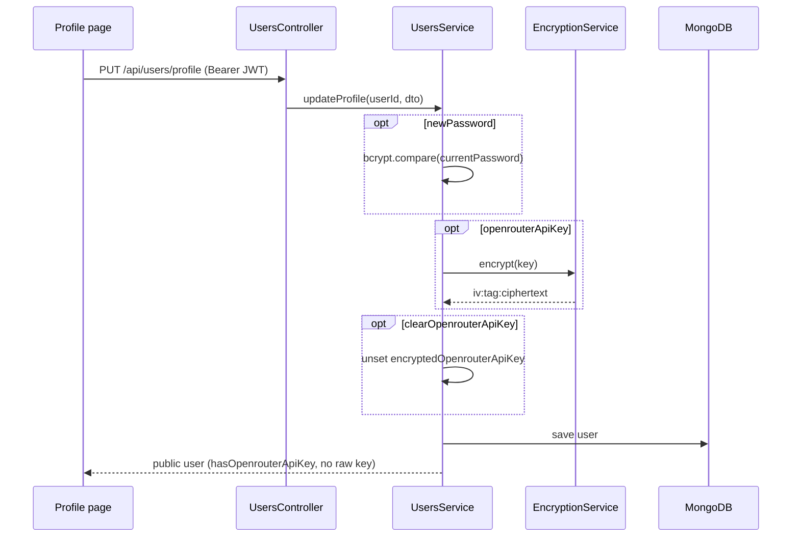
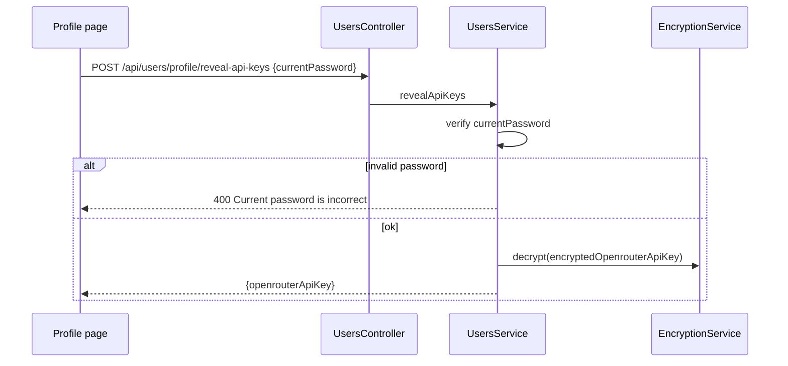
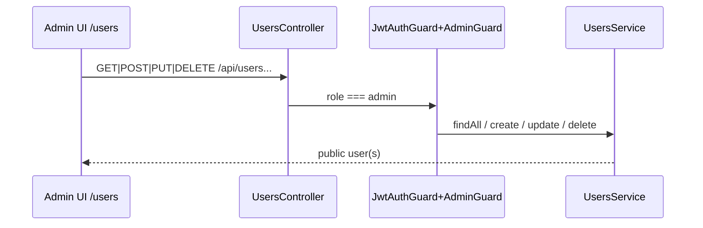

# Users workflow

## Purpose

Manage the current user’s profile (name, template, prompts, AI defaults, resume settings, OpenRouter API key), reveal/decrypt keys with password confirmation, fetch OpenRouter usage, and provide admin CRUD over all users.

## Actors

| Actor | Role |
|-------|------|
| Authenticated user | Reads/updates own profile; stores encrypted OpenRouter key |
| Admin | Full user CRUD (`JwtAuthGuard` + `AdminGuard`) |
| UsersService | Persist profile, encrypt/decrypt keys, public DTO shaping |
| EncryptionService | AES-256-GCM for OpenRouter keys |
| OpenRouterService | Key usage stats |

## Sequence diagrams

### Update profile (including API key)

### Reveal API keys

### Admin CRUD

## Key files

| Path | Notes |
|------|--------|
| `apps/backend/src/users/users.controller.ts` | Profile + admin routes |
| `apps/backend/src/users/users.service.ts` | CRUD, encryption, usage |
| `apps/backend/src/users/schemas/user.schema.ts` | User + `ResumeSettingsEmbedded` |
| `apps/backend/src/users/dto/update-user.dto.ts` | Profile/admin update fields |
| `apps/backend/src/users/dto/create-user.dto.ts` | Admin create |
| `apps/backend/src/users/dto/reveal-api-keys.dto.ts` | Password for reveal |
| `apps/backend/src/crypto/encryption.service.ts` | AES-256-GCM + scrypt |
| `apps/backend/src/ai/resume-settings.ts` | Defaults / skill categories |
| `packages/shared/src/resume-settings.ts` | Shared `resolveResumeSettings` |
| `apps/frontend/src/pages/profile/index.tsx` | Settings UI |
| `apps/frontend/src/pages/users/index.tsx` | Admin users page |
| `apps/frontend/src/services/userService.ts` | Client API helpers |

## Env vars

| Variable | Purpose |
|----------|---------|
| `ENCRYPTION_KEY` | Secret for scrypt-derived AES key; required to store/use OpenRouter keys |
| `DATABASE_URL` | MongoDB connection |

Without `ENCRYPTION_KEY`, encrypt/decrypt throws at runtime.

## API endpoints

All require JWT unless noted. Admin routes also require `AdminGuard`.

| Method | Path | Access | Description |
|--------|------|--------|-------------|
| `GET` | `/api/users/profile` | User | Current profile (public shape) |
| `PUT` | `/api/users/profile` | User | Update profile, settings, key |
| `POST` | `/api/users/profile/reveal-api-keys` | User | Decrypt key after password check |
| `GET` | `/api/users/profile/openrouter-usage` | User | OpenRouter key usage |
| `GET` | `/api/users` | Admin | List users |
| `GET` | `/api/users/:id` | Admin | Get user |
| `POST` | `/api/users` | Admin | Create user |
| `PUT` | `/api/users/:id` | Admin | Update user (incl. role, email, password) |
| `DELETE` | `/api/users/:id` | Admin | Delete user |

**Public user response** omits `password` and `encryptedOpenrouterApiKey`; includes `hasOpenrouterApiKey: boolean` and resolved `resumeSettings`.

**Profile update highlights:** `name`, `template`, `instructions`, `questionsPrompt`, `coverLetterPrompt`, AI defaults (`defaultAiModel`, `defaultAiVersion`, from-json defaults), `openrouterApiKey` / `clearOpenrouterApiKey`, `resumeSettings`, password change via `currentPassword` + `newPassword`.

## Error cases

| Case | Response |
|------|----------|
| User id not found | `404` |
| Change password without / wrong current password | `400` |
| Reveal keys without / wrong password | `400` |
| OpenRouter usage with no key | `400` (missing key message) |
| Non-admin on admin routes | `403` |
| Unauthenticated | `401` |
| Missing `ENCRYPTION_KEY` when saving/reading key | Server error |

## MongoDB data

**Collection:** `users`

| Field | Notes |
|-------|--------|
| `email`, `name`, `password`, `role` | Auth identity |
| `template` | `template1`…`template7` |
| `instructions` | Default resume prompt (industry=`default`) |
| `questionsPrompt`, `coverLetterPrompt` | Optional custom prompts |
| `defaultAiModel`, `defaultAiVersion` | Generation defaults |
| `defaultGenerateFromJson`, `defaultFromJsonAiModel`, `defaultFromJsonAiVersion` | From-JSON UI defaults |
| `encryptedOpenrouterApiKey` | `select: false`; AES blob `iv:authTag:ciphertext` (base64) |
| `resumeSettings` | Embedded: showTitle/SubTitle/CompanySkills, skillCategories, counts, `useDefaultOutputFormat` |
